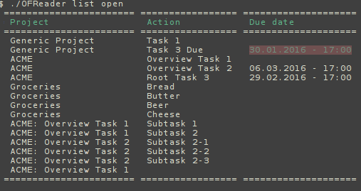

## Summary  

OFReader allows you to query an OmniFocus™ 2 SQLite database with ease through the command line. This tool is useful for people who use OmniFocus in their daily lives but also work on Linux machines and sometimes need information contained in OmniFocus.

## Installation

### Requirements

- Install composer
- Get dependencies: composer install

### Configuration

You need access to your OmniFocusDatabase2. It is not recommended to directly access your database, instead use a copy created by a cron job or LaunchAgent. You can find your database usually at `/Users/$USER/Library/Containers/com.omnigroup.OmniFocus2/Data/Library/Caches/com.omnigroup.OmniFocus2/OmniFocusDatabase2`.

The default location for the database is $HOME/OmniFocusDatabase2, use config.yml to define your custom location (see config.yml.default).

If your database is on another system, you can start with docs/sync-omnifocus.plist to upload it to a remote host.

## Usage

`./OFReader list (due|all|open|available) (--full)`

### Example output

## Todos

- Provide search capabilities
- Sort / group projects by subtasks
- Improve output options
- Support contexts 
- Support perspectives
- Add unit tests

I do not plan on adding write-support to this project, if you want to do so, consider forking this project. Otherwise, merge requests and feedback are very welcome.

## License 

Copyright (c) 2016 Hendrik Grahl

Permission is hereby granted, free of charge, to any person obtaining a copy of this software and associated documentation files (the "Software"), to deal in the Software without restriction, including without limitation the rights to use, copy, modify, merge, publish, distribute, sublicense, and/or sell copies of the Software, and to permit persons to whom the Software is furnished to do so, subject to the following conditions:

The above copyright notice and this permission notice shall be included in all copies or substantial portions of the Software.

THE SOFTWARE IS PROVIDED "AS IS", WITHOUT WARRANTY OF ANY KIND, EXPRESS OR IMPLIED, INCLUDING BUT NOT LIMITED TO THE WARRANTIES OF MERCHANTABILITY, FITNESS FOR A PARTICULAR PURPOSE AND NONINFRINGEMENT. IN NO EVENT SHALL THE AUTHORS OR COPYRIGHT HOLDERS BE LIABLE FOR ANY CLAIM, DAMAGES OR OTHER LIABILITY, WHETHER IN AN ACTION OF CONTRACT, TORT OR OTHERWISE, ARISING FROM, OUT OF OR IN CONNECTION WITH THE SOFTWARE OR THE USE OR OTHER DEALINGS IN THE SOFTWARE.

## Disclaimer

OmniFocus is a trademark and product of "The Omni Group". This project is not affiliated, sponsored or endorsed by them.
